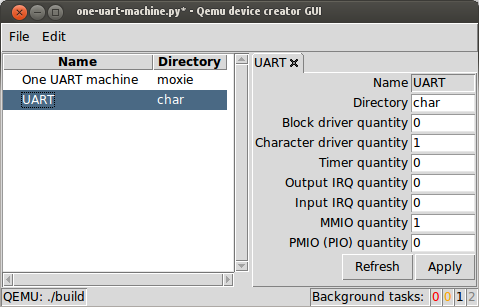

# QEMU Development Toolkit

The goal of this project is to automate device and machine development for
QEMU.

*Capabilities*:

- A device stub generator.
- A graphical editor representing a machine schematically.
It able to generate a machine draft.
- A common graphical user interface integrating both device and machine
generators.

*Current implementation limitations*:

- The device stub generator supports system bus and PCI(E) bus device
generation only.
- The machine draft generator does not generate CLI argument accounting.
A developer have to implement it manually if required.
- A CPU instantiation is also too specific and not fully supported.
Therefore, a developer have to handle it after generation.
- Old-style device models which are normally instantiated in specific way, are
not supported by machine graphical editor.
But a developer still can use device stub generator to update implementation
of such devices.
After that, those devices do become supported by the editor.

### Device stub generation overview

A device model in QEMU is a module and a header in C language whose implements
the behavior and other specifics of the device.
The implementation uses the API provided by the QEMU infrastructure.
Usage of elements of the API is quite similar from one device to another.
The generator utilizes this feature to generate both a header and a module
for the device with API stubs.
Amount of generated lines is 11-25 times more than the size of generation
parameters.
The GUI does simplify the setting of those parameters.

Generated device stubs are registered in QEMU build system and ready to
compile.
A developer may immediately concentrate on the device specifics implementation.

### Machine draft generation overview

A machine model in QEMU is a module in C language.
The main part of a machine module is the machine initialization function.
The function is a sequence of device, bus, IRQ and memory instantiations.
QEMU provides common API to instantiate and interconnect those machine nodes.
Of course there is some auxilary code in the module.
The toolset uses an object model describing the content of a machine.
Each class of this model describes corresponding machine node.
There is a graphical editor which provides a schematic visualization of
machine content.
The editor is paired with a generator producing a module draft for the machine
represented in the editor.

A generated machine draft contains most of the machine code.
It includes the initialization function and most of the auxilary code.
The draft is also registered in QEMU build system and ready to build.

## Getting started

The toolset is written in Python.
Both 2.7.3+ and 3.3+ versions are supported.

### Environment preparation

- *This manual is tested on Ubuntu 14.04 and Debian 7.11.*
- *Compatibility with MS Windows OSes are not tested yet*
*but it is an objective.*

There is a briefly guide to environment preparation for several OSes.
A clear OS installation is taken as the start point.

#### Ubuntu Linux

Ubuntu 14.04 is already shipped with both 2.x and 3.x Python.
But several prerequisites are not installed by default.

Tkinter is used as GUI back-end.

```bash
sudo apt install python-tk python3-tk
```

`idlelib` is also involved.

```bash
sudo apt install idle-python2.7 idle-python3.4
```

Note that `idle-python` package name suffix corresponds to the Python version.

`pip` is required to install several prerequisites.

```bash
sudo apt install python-pip python3-pip
```

QDT adapts to changes in QEMU infrastructure.
It has a set of heuristics referring to specific commits in QEMU Git history.
`gitpython` package is used to analyze Git graph and get effective heuristics
for the current QEMU version.

```bash
sudo pip install --upgrade gitpython
sudo pip3 install --upgrade gitpython
```

`six` package is used to handle 2.x and 3.x Python version differences.

```bash
sudo pip install --upgrade six
sudo pip3 install --upgrade six
```

Now the all environment prerequisites are satisfied.

#### Debian Linux

Debian 7.11 environment preparation is same as the one for Ubuntu 14.04
except for several specifics.

- `apt-get` command must be used everywhere instead of `apt`

- Python 3.2 grammar version is too old and does not supported by the toolset.
I.e. only Python 2 can be used.

- `python-pip` package is too old.
Hence, consider
[another](https://unix.stackexchange.com/questions/182308/install-python-pip-in-debian-wheezy)
way to install `pip`.

```bash
wget https://bootstrap.pypa.io/get-pip.py
sudo python get-pip.py
```

### Installation

QDT is suddenly required a QEMU to work with.
So, the first objective is to get its sources.

```bash
~$

mkdir qemu
cd qemu
git clone git://git.qemu.org/qemu.git src
cd src
git checkout -b qdt_testing v2.9.0
git submodule init
git submodule update --recursive
```

The toolset works with a build directory.
Hence, QEMU build system have to be configured.
Of course, the QEMU build dependencies must be satisfied first.

```bash
sudo apt-get build-dep qemu
```

A good practice is to use out-of-source tree build.
And this manual follows it.

```bash
~/qemu/src$

cd ..
mkdir build
cd build
../src/configure --target-list=moxie-softmmu
```

The target list is shorted to speed up consequent building.
QDT is not limited to moxie CPU architecture.

It is time to get QDT itself.
Note that, several dependencies of QDT are embedded as submodules.

```bash
~/qemu/build$

cd ..
git clone http://nasredin.intra.ispras.ru:3000/qemu/qdt.git
cd qdt
git submodule init
git submodule update --recursive
```

Now you can launch the GUI.

```bash
~/qemu/qdt$

./qdc-gui.py
```

An example project of Intel Q35 machine will be automatically loaded.
Do nothing if you wish to pass consequent examples without troubles.
Just check it works and close the main windows without saving the project.

### Basic device stub generation

To generate a device stub the two steps should be made.

1. Create a Python script with generation parameters.
2. Pass the script to the command line generator tool `qemu_device_creator.py`.

Simple `basic-device.py` script content is listed below.

```python
uart_desc = SysBusDeviceDescription(
    # name =
    "UART",
    # directory =
    "char"
)
p = QProject([uart_desc])
```

No imports are required.
The generator will provide all necessary names by self.

`SysBusDeviceDescription` class is a container for parameters of system
bus device generation.
There are only two parameters provided.

- `name` is a base for generation of new QOM type name, macro, function names
and so on.
It will be transformed according to C syntax and QEMU coding style.
See resulting code if interesting.

- `directory` is the name of subdirectories in "hw" and "include/hw".
Generated module and header will be placed in corresponding subdirectories.
Note that devices are grouped according to semantic.

Note that `name` and `directory` arguments are actually commented out by
`#` prefix.
This means that they are positional and those names can be skipped.
A Keyword argument is always set using its name across this manual.

All generation parameters must be packed in a project (`QProject`).
The generator expects one `QProject` in the input script.

Now the device model stub can be generated.

*Note that during first launch the generator will analyze QEMU sources.*
It is a time-consuming operation.
A few minutes are commonly required to complete.
The result of this analyze will be cached in the build directory.
An analyze is required each time the QEMU version (HEAD) changes.

```bash
~/qemu$

cd ..
qdt/qemu_device_creator.py -b ./build basic-device.py
```

Take note of `-b` (`--qemu-build`) argument.
It specifies a path that points to QEMU build directory.
This way the generator may realize where the QEMU is.

Now look at the changes on QEMU sources.

```bash
~/qemu$

cd src
git status
```

Two new files should be created:

- `hw/char/uart.c`
- `include/hw/char/uart.h`

Also `hw/char/Makefile.objs` file should be changed.
QDT registered new device in QEMU build system.

### Basic machine draft generation

Basic machine draft generation is very similar to device stub generation.

Simple `basic-machine.py` script is listed below.

```python
mach = MachineNode(
    # name =
    "One UART machine",
    # directory =
    "moxie"
)
p = QProject([mach])
```

The main difference is usage of `MachineNode` instead of
`SysBusDeviceDescription`.

After generation the only one file appeared: `hw/moxie/one_uart_machine.c`.
A machine module is normally presented by only the module.
A header is not required.
Of course, `hw/moxie/Makefile.objs` file is changed too.
So, the new machine is registered in QEMU build system.

### Simple composite project

Now consider a very simple moxie CPU one UART machine with 1 KiB of RAM.
The UART is very simple too.
It has only one register.
And any data written to that register will be printed to its channel.
A UART with only that functionality is a transmitter only actually...

The script `one-uart-machine.py` is a composition of previous two scripts
with several significant improvements.

```python
# UART stub generation settings
# -----------------------------
uart_desc = SysBusDeviceDescription("UART", "char",
    mmio_num = 1,
    char_num = 1
)

# One UART machine generation settings
# ------------------------------------

# UART instantiation and interconnection
uart = SystemBusDeviceNode(
    # TYPE_UART is a macro corresponding to new device "UART"
    # qom_type =
    "TYPE_UART",
    # A base for generation of name of variable pointing to UART instance
    var_base = "uart",
    # the UART is follows the RAM
    mmio = [ 0x2000 ]
)
# Note that `uart` variable is related to the same device as `uart_desc`.
# But `uart_desc` describes the UART from within while `uart` does it
# externally, from the machine point of view.

# The UART has one slot for a "character device" (chardev). The chardev is a
# full-duplex bytewise FIFO. Normally, it corresponds to a serial interface
# inside a guest OS. By default QEMU instantiates a Virtual Terminal Emulator
# to use it at opposite side of a chardev. The default name is "serial0".
# A VTS is connected to UART using a property. The one named "chr" is
# added to UART device stub with "UART_CHR" macro alias. The property
# assignment below will result in connection between the UART instance and
# the VTE.
uart.properties.append(
    QOMPropertyValue(QOMPropertyTypeString, "UART_CHR", "serial0")
)

# System address space is the root of memory hierarchy of any QEMU machine
sas = MemorySASNode(
    # name =
    "System address space"
)

# RAM instantiation
ram = MemoryRAMNode(
    # name =
    "RAM",
    # size =
    0x1000,
    var_base = "ram"
)
# Include RAM into system address space at offset 0x1000. It is default reset
# program counter value. I.e. it is an entry point.
sas.add_child(ram, offset = 0x1000)

mach = MachineNode("One UART machine", "moxie",
    devices = [uart],
    mems = [sas]
)
# Note that not all machine nodes must be explicitly passed to MachineNode
# object. The generator can lookup other nodes if they are binded with
# explicitly added nodes by any way.
# For instance, `ram` is included into `sas` and will be accounted implicitly.

p = QProject([mach, uart_desc])
```

After passing of this script to the generator the same files will be
changed and added as in previous two examples.

Yet another steps is required to make this machine working.

#### Implement UART

This UART is very simple.
It just prints a byte written to its register.
Open `hw/char/uart.c` module with any editor.
Then replace `uart_mmio_write` function implementation with code listed below.

```c
static void uart_mmio_write(void* opaque, hwaddr offset, uint64_t value,
                            unsigned size)
{
    UARTState *s = UART(opaque);
    uint8_t buf[1] = { (uint8_t) value };
    qemu_chr_fe_write(&s->chr, buf, 1);
}
```

Now the UART is ready.

#### Instantiate Moxie CPU

A CPU instantiation is frequently architecture specific.
As a result, it is not supported by machine draft generator yet.
Therefore, there is only one absent part of the machine - its CPU.

Add the line listed below to the beginning of machine initialization function
`init_one_uart_machine` in file `hw/moxie/one_uart_machine.c`.

```c
    cpu_moxie_init("MoxieLite-moxie-cpu");
```

Of course, the corresponding header must be included too.

```c
#include "cpu.h"
```

Now the machine has the CPU.

#### Loading guest code

There are many ways to load guest binary code into RAM.
The simplest one is to just read it from a RAW file.
QEMU CLI provides few ways to pass a file name to a machine.
The `-kernel` argument will be used there.
Append the code below to the machine initialization function to support
RAW file loading.

```c
    FILE *f = fopen(machine->kernel_filename, "rb");
    fread(memory_region_get_ram_ptr(ram), 1, 4096, f);
    fclose(f);
```

Now an arbitrary guest can be loaded into the machine.
_Note that this straightforward guest loading technique should not be used in_
_a real machine model_.

#### Building QEMU

At this moment the machine is implemented.
Go to the build directory and make it.

```bash
~/qemu/src$

cd ../build
make
```

Ask QEMU for list of available machines to check if all is good.

```bash
~/qemu/build$

moxie-softmmu/qemu-system-moxie -machine ?
```

The line `one_uart_machine     TODO: provide description for One UART machine`
must present in the output.
`one_uart_machine` is the name of just created machine model.

#### Easier than "Hello, World!"

Consider a program that writes a character to the FIFO of the UART.

```
00001000: inc   $r0, 0xA0          # move `@` ASCII code to r0 register
                                   # (r0 equals to zero at startup)
00001002: sta.b 0x00002000, $r0    # write r0 to UART register
00001008: jmpa  0x00001008         # fall into infinite loop
```

Reminder that the entry point is 0x1000.
A binary code
[corresponding](http://moxielogic.org/blog/pages/architecture.html)
to that assembly code has been obtained manually.
The command below will produce a RAW file `simple.bin` containing this
program.

```bash
~/qemu/build$

echo -ne "\x80\xA0\x1F\x00\x00\x00\x20\x00\x1A\x00\x00\x00\x10\x08" > simple.bin
```

Now the program can be launched in the virtual machine.

```bash
~/qemu/build$

moxie-softmmu/qemu-system-moxie -M one_uart_machine -kernel simple.bin
```

Switch to `serial0` VTE to check its output.
Ctrl-Alt-2 accelerator can be used to do it.
The only one character "`@`" must be in the output.

### The GUI

It is time to look at the one UART machine using the GUI.

```bash
~/qemu/build$

cd ..
qdt/qdc-gui.py one-uart-machine.py -b ./build
```

Note that QEMU build directory path can be specified with GUI.
`Ctrl-B` accelerator raises a directory selection dialog allowing a user to
select the path.



The generation process can be started using `Ctrl-G` accelerator.

Be careful, if you save the project in same file (including `Ctrl-S`
accelerator) its content will be fully regenerated.
Only code logic will be preserved.
I.e. the comments will be lost.
Code formatting will not be preserved too while will be pretty.
Several GUI specific code will be added too.
Of course, a script produced by the GUI is compatible with the CLI generator
front-end.

Also note that the GUI always saves last opened project in `project.py`
script in current working directory for backup.
So, do *not* use such name for real project scripts.

### Q35 Machine

There is a complex project example: Intel Q35 chipset based PC machine.
The project is based on `q35` machine implementation in QEMU.

```bash
~/qemu$

qdt/qdc-gui.py qdt/examples/q35-for-q2.6.py
```
